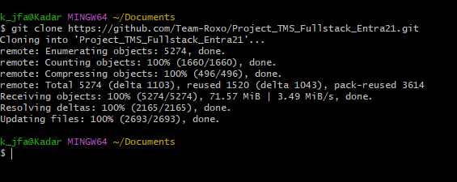
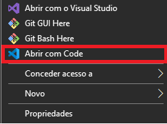

# <b>TMS PROJECT - ENTRA21 FULLSTACK DEV</b>

---
## 📜SUMÁRIO
><b>1. RESUMO</b>
>
>><b>1.1 <a href="#resume"> Da Licença, Disponibilidade e Finalidade</b></a>
>>
>><b>1.2 <a href="#stack"> Das Tecnologias Utilizadas</b></a>
>
><b>2. ORGANIZAÇÃO DO PROJETO</b>
>
>><b>2.1. <a href="#org_geral"> Visão Geral</b></a>
>>
>><b>2.2. <a href="#org_fluxograma"> Fluxograma</b></a>
>>
>><b>2.3. <a href="#org_estrutura"> Estrutura Macro</b></a>
>>
>><b>2.4. <a href=""> Futuras Features</b></a>
>>
>><b>2.5. <a href=""> Instalação </b></a>
>
><b>3. SOFTWARE</b>
>
>><b>3.1. <a href="#soft_google"> GOOGLE CLOUD</b></a>
>>
>>><b>3.1.1. <a href="#google_api"> Google API </a></b>
>>>
>>>><b>3.1.1.1. <a href="#directions"> Directions API </a></b>
>>>>
>>>><b>3.1.1.2. <a href="#distance"> Distance Matrix API </a></b>
>>>>
>>>>
>>>><b>3.1.1.3. Compute Engine API</b>
>>>
>>><b>3.1.2. Instâncias Virtuais</b>
>>>
>>>><b>3.1.2.1. Resumo</b>
>>>>
>>>><b>3.1.2.2. Instalação e Implementação</b>
>>>
>>><b>3.1.3. Cloud SQL</b>
>>>
>>>><b>3.1.3.1. Resumo</b>
>>>>
>>>><b>3.1.3.2 Instalação e Implementação</b>
>>>
>><b>3.2. FRONTEND</b>
>>
>>><b>3.2.1. Componentes</b>
>>>>
>>>><b>3.2.1.1. Login</b>
>>>>>
>>>>><b>3.2.1.1.1. CanActivate
>>>>>
>>>>><b>3.2.1.1.2. HttpClient
>>>>
>>>><b>3.2.1.2. Home</b>
>>>>
>>>><b>3.2.1.3. Dashboard</b>
>>>>>
>>>>><b>3.2.1.3.1. Contador de Clientes e Visitantes</b>
>>>>>
>>>>><b>3.2.1.3.2. Registro de Pacotes</b>
>>>>>
>>>>><b>3.2.1.3.3. Bounce Rate</b>
>>>>
>>>><b>3.2.1.4. Users</b>
>>>>
>>>><b>3.2.1.5. Pacotes</b>
>>>>>
>>>>><b>3.2.1.5.1. Recent Quote
>>>>>
>>>>><b>3.2.1.5.2. Register Quote
>>>>>
>>>>><b>3.2.1.5.3. Tracking Package
>>>
>>><b>3.2.2. Services</b>
>>>>
>>>><b>3.2.2.1. Login Service</b>
>>>>
>>>><b>3.2.2.2. Quote Service</b>
>>>
>>><b>3.2.3. Segurança (A analisar)
>>>>
>>>><b>3.2.3.1. Dados do Login
>>>>
>>>><b>3.2.3.2. Encriptação dos Dados
>>
>><b>3.3. BACKEND</b>
>>>
>>><b>3.3.1. Spring Boot</b>
>>>>
>>>><b>3.3.1.1. Projeto</b>
>>>>
>>>><b>3.3.1.2. Dependências</b>
>>>>
>>><b>3.3.2. Controllers</b>
>>>>
>>>><b>3.3.2.1. Login</b>
>>>>
>>>><b>3.3.2.2. Register</b>
>>>>
>>>><b>3.3.2.3. User</b>
>>>>
>>>><b>3.3.2.4. Visitantes</b>
>>>>
>>>><b>3.3.2.5. Packages</b>
>>>>
>>>><b>3.3.2.6. Google</b>
>>>>
>>><b>3.3.2. Spring Login Security</b>
>>>>
>>>><b>3.3.2.1. Encriptação da Senha do Usuário</b>

## 1 - RESUMO

 
 <b>1.1 - Da Licença, Disponibilidade e Finalidade </b> 

#### &nbsp;&nbsp;&nbsp;&nbsp; Esse projeto foi desenvolvido pelo grupo Roxo da Turma Java Noturno de 2022, composto por <b>Bruno Roberto, Cristian Schauffert, Kalil Fakhouri e Mateus Felipe</b> com a mentoria do <b> professor Oliota</b>, visando apenas a demonstração dos conhecimentos técnicos adquiridos durante o curso e a apresentação da etapa final à empresas.

#### &nbsp;&nbsp;&nbsp;&nbsp; <b>A cópia do recurso está disponível a todos, podendo ser modificada e alterada. Fica proibida a venda, distribuição ou repasse da mesma. </b>

#### &nbsp;&nbsp;&nbsp;&nbsp; A maioria dos recurso e tecnologias são de código livre (open-source) ou teste de avaliação por tempo determinado (Google Cloud), afim de trazer a melhor experiência do uso de um software funcional. Devido ao nosso objetivo de comprovar os conhecimentos adquiridos, algumas partes do software são simulados (porém não "Mockados") devido ao tempo e resposta que levaria na realidade, acelerando, assim, o processo de entrega, por exemplo, para que possa ser vista em tempo real o processamento de dados, tanto localmente quanto em nuvem.

 

 
 <b>1.2 - Das Tecnologias Utilizadas</b> 

#### &nbsp;&nbsp;&nbsp;&nbsp; Durante o curso foi utilizado diversas tecnologias, métodos ágeis e ferramentas de desenvolvimento tais como:

> #### Linguagens:
>> * #####  Java
>> * #####  JavaScript
>> * #####  TypeScript
>> * #####  CSS
>> * #####  HTML
> #
> #### Tecnologias:
>> * #####  Spring Boot
>> * #####  Angular
>> * #####  Electron
>> * #####  MySQL
> #
> #### Ferramentas:
>> * #####  Eclipse IDE
>> * #####  Visual Studio Code
>> * #####  Postman
>> * #####  Google Cloud
> #
> #### Metodologia:
>> * #####  Trello - Kanban
> #
> #### Versionamento:
>> * #####  Github
>> * #####  Git

  

# 2 - ORGANIZAÇÃO DO PROJETO

<b>2.1 - Visão Geral</b>

#### &nbsp;&nbsp;&nbsp;&nbsp; 

  

<b>2.2 - Fluxograma</b>

  

<b>2.3 - Estruturamento Macro</b>

#### &nbsp;&nbsp;&nbsp;&nbsp; Começando pelo nosso <b>Banco de Dados</b>, sua organização foi detalhadamente pensada para os fins que queríamos, como por exemplo um método muito utilizado por nós, foi o relacionamento dos objetos um com os outros. Isso foi de extrema importância, pois o usuário terá todos os detalhes das transações, além de dificultar o acesso direto aos dados.

#### &nbsp;&nbsp;&nbsp;&nbsp; Em nossa <b>API RESTful</b>, temos 4 pacotes que movem nossa API (Classe Principal, Controllers, Repositório e Models), dentro deles cada um tem sua função específica e dividida, como os controllers fornecerem as rotas e processamento de dados para nos fornecer o solicitado. A nossa Interface, que é utilizado como repositório, usa <b><i>Anottations</i></b> para comunicar diretamente com o nosso Banco de Dados na nuvem, utilizando as configurações definidas no arquivo <i><b>"application.properties"</i></b>, mas também utilizamos a dependência do JPA Repository, tanto para a comunicação com o Banco de Dados quanto a consulta personalizada, utilizando argumentos como <b>UPDATE, DELETE, EXTRACT, MONTH(), DAY(), BETWEEN</b> e outros. Claro que para DELETE poderíamos utilizar apenas o <i><b>repository.deleteById()</i></b>, mas como em alguns casos o delete não pode ser geral, fizemos funções especificas como <b>Deletar Relacionamento entre usuários e empresas</b> (evitando excluir todos os dados relacionados aos dois).

#### &nbsp;&nbsp;&nbsp;&nbsp; No nosso aplicativo em <b>Angular</b>, fizemos várias validações de resposta quanto de erros ocasionados por credenciais erradas ou falha na comunicação com o servidor. Nenhum dado sensível é armazenado no frontend devido ao pública visualização da mesma, como a <i><b>API_KEY</i></b> utilizada para acessar o Banco de Dados do Google Maps.

  

<b>2.4 - Futuras Features</b>

#### &nbsp;&nbsp;&nbsp;&nbsp; Devido a nossa Deadline o projeto final teve sua versão 1.0.0 de acordo com o possível, deixando a maioria de suas funcionalidades operacionais, porém, há mais que queremos fazer e categorizar nosso projeto como um trabalho profissional!

São elas:

 * FEAT - Implementar Criptografia JWP ou AES256 no Frontend e Backend.
 * STYLE - Melhorar Design dos Componentes.
 * PERF - Utilizar WebSocket ao invés de um loop cronometrado.
 * PERF - Melhorar cálculo de frete utilizando mais dados.
 * FEAT - Utilizar o calendário para armazenar dados de contar a pagar, receber e outros.
 * STYLE & PERF - Melhorar o componente "Finance", tanto graficamente quanto em funcionalidades.
 * FIX - Melhorar validações de requisições, entrada e processamento de dados.
 * FEAT - Terminar de implementar a API para envio do email de recuperação da senha ou confirmação do email.

  

2.5 - Instalação

#### &nbsp;&nbsp;&nbsp;&nbsp; Para utilização do nosso aplicativo há duas formas, em modo desenvolvedor ou como usuário final.

#### &nbsp;&nbsp;&nbsp;&nbsp; 1. Para utilizar como desenvolvedor, baixe o repositório do projeto colando o comando `git clone https://github.com/Team-Roxo/Project_TMS_Fullstack_Entra21.git` no seu terminal Git. Você precisará do framework instalado em sua máquina, você pode baixar ele clicando <a href="https://nodejs.org/dist/v16.18.0/node-v16.18.0-x64.msi">aqui</a> e instalando de acordo com os passos solicitados. 

</img>

#### &nbsp;&nbsp;&nbsp;&nbsp;Após isso, vá na pasta criada quando você clonou o repositório e entre na subpasta `frontend`, abra o terminal nessa pasta clicando em `Shift + <botão direito do mouse>` e `Abrir janela do PowerShell aqui` ou o terminal referente ao seu Sistema Operacional.
</img>

#### &nbsp;&nbsp;&nbsp;&nbsp; Com o Terminal aberto, cole o comando `npm i` e pressione `Enter`. Após o node finalizar a instalação de todas as dependências necessárias, cole o comando `npm start` ou `ng serve` e `Enter` novamente, ele iniciará o servidor do projeto localmente, para acessar e começar a utilizar o aplicativo, basta copiar a URL disponibilizada na penúltima linha de resposta e colar na aba de links do seu browser.

</img>

#### &nbsp;&nbsp;&nbsp;&nbsp; OBS.: NÃO FECHE O TERMINAL ENQUANTO UTILIZA O APLICATIVO, POIS ELE É NECESSÁRIO PARA O FUNCIONAMENTO DO MESMO!

#### &nbsp;&nbsp;&nbsp;&nbsp; 2. Para utilizar como usuário final, você terá duas opções bem simples. A primeira você precisará do Git instalado em sua e baixar nosso repositório da branch `compiled` utilizando o comando `git clone --branch compiled https://github.com/Team-Roxo/Project_TMS_Fullstack_Entra21.git`, após isso entre na pasta raiz do projeto clonado, clique com o `botão direito do mouse` e selecione `Abrir com Visual Code`.

</img>

#### &nbsp;&nbsp;&nbsp;&nbsp; Após abrir o Visual Studio Code, selecione 

  

# 3 - SOFTWARE

<b>3.1 - GOOGLE CLOUD</b>

 

<a href="https://github.com/Team-Roxo/Project_TMS_Fullstack_Entra21/blob/main/assets/README.md">Clique aqui para aprender a configurar o Google Cloud</a>

>## <b id="google_api"> 3.1.1 - Google API </b>
>>### <b id="directions"> 3.1.1.1 - Directions API </b>
>>
>>#### &nbsp;&nbsp;&nbsp;&nbsp;&nbsp;&nbsp;&nbsp;&nbsp; A API Directions é um serviço da Web que usa uma solicitação HTTP para retornar rotas no formato JSON ou XML entre os locais. As rotas estão disponíveis de várias maneiras: 
>>
>> * #### como uma API independente.
>> * #### como parte da API Maps JavaScript do lado do cliente.
>> * #### para uso do servidor como parte das bibliotecas de cliente dos Serviços da Web do Google Maps.
>>
>> #### &nbsp;&nbsp;&nbsp;&nbsp;&nbsp;&nbsp;&nbsp;&nbsp; Esta API aceita tanto endereços do tipo texto como também latitudes e longitudes previamente formatadas de acordo com o padrão estabelecido.
>>
>>### <b id="distance">3.1.1.2 - Distance Matrix API </b>
>>
>>#### &nbsp;&nbsp;&nbsp;&nbsp;&nbsp;&nbsp;&nbsp;&nbsp; A API Distance Matrix fornece a distância e o tempo de viagem de uma matriz de origens e destinos e consiste em linhas que contêm os valores duration e distance para cada par. A Distance Matrix está disponível de várias formas:
>>
>> * #### como uma API independente.
>> * #### como parte da API Maps JavaScript do lado do cliente.
>> * #### para uso do servidor como parte das bibliotecas de cliente dos Serviços da Web do Google Maps.
>>
>> #### &nbsp;&nbsp;&nbsp;&nbsp;&nbsp;&nbsp;&nbsp;&nbsp; A API retorna informações com base na rota recomendada entre os pontos inicial e final. Você pode solicitar dados de distância para diferentes meios de transporte, solicitar dados de distância em diferentes unidades, como quilômetros ou milhas, e estimar o tempo de viagem no trânsito.
>>
>>### <b id="compute"> 3.1.1.3 - Compute Engine API </b>
>>
>> #### &nbsp;&nbsp;&nbsp;&nbsp;&nbsp;&nbsp;&nbsp;&nbsp; Cria e executa máquinas virtuais no Google Cloud Platform. O Google Compute Engine oferece máquinas virtuais que são executadas nos data centers do Google conectados à rede de fibra óptica global. As ferramentas e o fluxo de trabalho oferecidos permitem o escalonamento de instâncias únicas para computação em nuvem com balanceamento de carga global.
>> #### &nbsp;&nbsp;&nbsp;&nbsp;&nbsp;&nbsp;&nbsp;&nbsp; Essas VMs são inicializadas rapidamente, vêm com armazenamento em disco permanente e proporcionam desempenho consistente. As máquinas estão disponíveis em muitas configurações, incluindo tamanhos predefinidos e também podem ser criadas com tipos de máquinas personalizados de acordo com suas necessidades específicas.
>>

